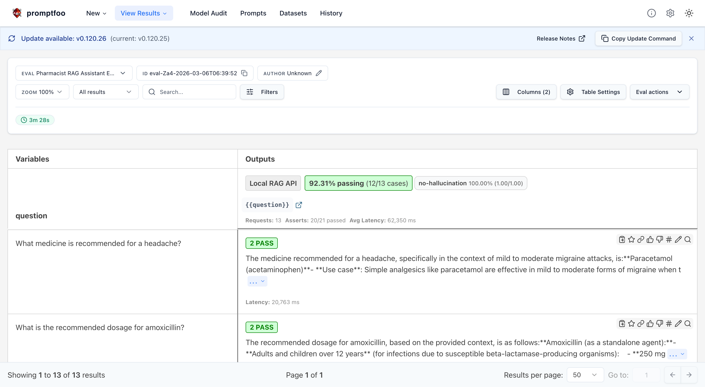

# 🧠 Local LLM System

This project is a fully Dockerized **Retrieval-Augmented Generation (RAG)** system that lets you ask questions over documents in a folder — completely offline.

It features:
- 🤖 **Ollama** for local LLM inference (e.g. Mistral, Phi-3, Qwen)
- 🔍 **LlamaIndex** for document indexing and retrieval
- 🗂️ **FAISS** for fast in-memory vector search
- ⚡ **FastAPI** backend with streaming support (SSE)
- 🌐 **Streamlit** frontend UI with live token streaming
- 🔄 **Live reload & folder watching** for auto reindex

---

## 📦 Features

- ✅ Document indexing from `./files` folder
- ✅ LLM query answering with sources
- ✅ Streamed response via Server-Sent Events (SSE)
- ✅ Hot-reload dev mode (`--reload` + volume mounts)
- ✅ Configurable LLM and embedding models via `.env`

---

## 🚀 Quickstart

### 1. Clone the repo

```bash
git clone https://github.com/reefwn/local-llm
cd local-llm
```

### 2. Pull required Ollama model

```bash
ollama pull qwen2.5:7b-instruct-q2_K
```

### 3. Start all services
```bash
docker-compose up -d
```

### 4. Open your browser
- Streamlit UI: [http://localhost:8501](http://localhost:8501)
- FastAPI docs: [http://localhost:8000/docs](http://localhost:8000/docs)

## ⚙️ Environment Configuration

Create a .env file

```dotenv
FILES_PATH=/app/files
MODEL_NAME=qwen2.5:7b-instruct-q2_K
OLLAMA_API=http://host.docker.internal:11434
EMBEDDING_MODEL=sentence-transformers/all-MiniLM-L6-v2
CHUNK_SIZE=1024
CHUNK_OVERLAP=128
FAISS_PERSIST_DIR=/app/faiss_index
FAISS_DIM=384
```

## 🗂️ Folder Structure

```bash
.
├── api/               # FastAPI backend + LlamaIndex logic
├── ui/                # Streamlit frontend
├── files/             # Drop your documents here (PDF, TXT, MD, CSV)
├── Dockerfile.api     # API Dockerfile
├── Dockerfile.ui      # UI Dockerfile
├── docker-compose.yml
├── requirements.api.txt
├── requirements.ui.txt
└── .env
```

## 🧪 Supported Models

Any [Ollama-supported](https://ollama.com/library) model like:
  - qwen2.5:7b-instruct-q2_K, qwen2.5:3b
  - mistral, mistral:instruct, mistral:Q4_0
  - phi3:mini
  - gemma:2b, tinyllama:chat
  - llama2:7b, etc.

Make sure to `ollama pull <model>` before using it.

## 🧪 Eval with Promptfoo

This project includes a [promptfoo](https://www.promptfoo.dev/) evaluation suite in the `eval/` folder to test the RAG API responses.

### Setup

```bash
cd eval
python3 -m venv .venv
source .venv/bin/activate
pip install requests
```

### Run

Make sure the API is running on `localhost:8000`, then:

```bash
PROMPTFOO_PYTHON=.venv/bin/python promptfoo eval --no-cache
```

### View results

```bash
promptfoo view
```



---

## ❓ Example Query

> "Summarize all documents in simple terms."

Or:

> "What are the company leave policies mentioned in the PDFs?"

## ❤️ Credits

Built with:
- [Ollama](https://ollama.com)
- [LlamaIndex](https://www.llamaindex.ai)
- [FAISS](https://github.com/facebookresearch/faiss)
- [Streamlit](https://streamlit.io)
- [FastAPI](https://fastapi.tiangolo.com)

Files:
- [Medicine_Details.csv](https://www.kaggle.com/datasets/singhnavjot2062001/11000-medicine-details)
- [who-model-formulary-2008.pdf](https://iris.who.int/handle/10665/44053)
